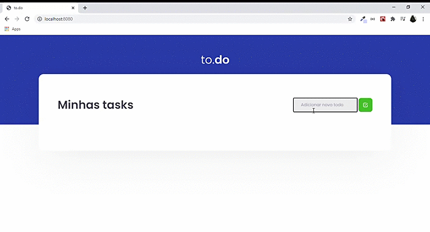

<h1 align="center">🚀 DESAFIO TO-DO 🚀</h1>
<p align="center">📝Aplicação para criação e deleção de tarefas juntamente com marcação se foi concluída ou não. ✌🏼</p>

<div align="center">


</div>

<p align="center">
 <a href="#status">Status</a> •
 <a href="#features">Features</a> • 
 <a href="#demonstracao">Demonstração</a> • 
 <a href="#requisitos">Pré-requisitos</a> • 
 <a href="#tecnologias">Tecnologias</a> • 
 <a href="#autor">Autor</a>
</p>

---

### <strong><a id="status">Status</a>   </strong>
    ✅ PROJETO CONCLUÍDO ✅
---

### <strong><a id="features"> Features</a></strong>

- [x] Criação de Tasks
- [x] Marcação de concluída ou não
- [x] Deleção de Tasks
---
### <strong><a id="demonstracao">Demonstração</a></strong>




---
### <strong><a id="demonstracao">Pré-requisitos</a></strong>

Antes de começar, você vai precisar ter instalado em sua máquina as seguintes ferramentas:
[Git](https://git-scm.com), [Node.js](https://nodejs.org/en/). 
Além disto é bom ter um editor para trabalhar com o código como [VSCode](https://code.visualstudio.com/)

---

### 🎲 Rodando o Projeto

```bash
# Clone este repositório
$ git clone https://github.com/mateus-de-oliveira/to-do-list.git

# Acesse a pasta do projeto no terminal/cmd
$ cd to-do-list

# Instale as dependências
$ yarn install

# Execute a aplicação em modo de desenvolvimento
$ yarn dev

# O servidor inciará na porta:8080 - acesse http://localhost:8080
```
---
### ⚒️ Tecnologias

As seguintes ferramentas foram usadas na construção do projeto:

- [Node.js](https://nodejs.org/en/)
- [React](https://pt-br.reactjs.org/)
- [TypeScript](https://www.typescriptlang.org/)
- [Babel](https://babeljs.io/)
- [Webpack](https://webpack.js.org/)

---
### 🙆🏻‍♂️ Autor
<br>
 


Feito com ❤️ por Mateus de Oliveira 👋🏽 Entre em contato!

[](mailto:mateusdeoliveira1530@gmail.com)

---
## 📝 Licença

Este projeto esta sobe a licença [MIT](./LICENSE).
